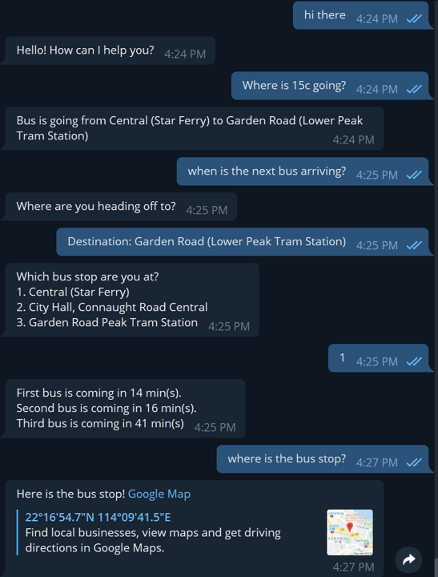

# BusBot
This project is a simple bus chatbot allowing users to enquire bus estimated arrival time on Telegram. In the current scope of the project, it is only connected to Citibus/NWFB API.

### Libraries/Tools used in this project

1. Google Dialogflow
   * Dialogflow is Google-owned chatbot development framework. We used it to build chatbot intent, training phrases, fulfillment & response, then integrate the chatbot to Telegram.

2. Flask webhook
   * After getting response from the Bus API, there is need to handle the data with some logic. So we wrote the handling inside a Flask webhook in Python.

3. Ngrok
   * For testing, we use ngrok to publish our local Flask port as a public URL so to connect our webhook to Dialogflow fulfillment.
   
4. Telegram
   * Users can interact with our chatbot directly in Telegram.
      
   
### Demo

### Presentation Slides
You may refer to the following presentation slides for design and implementation detail:

[Slides](https://drive.google.com/open?id=1EDiTk0iCbc19idYrmdvDG2t5Ade7eNJm)
